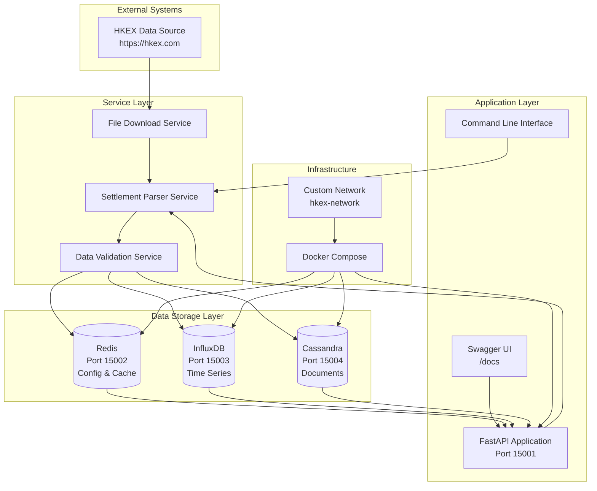

# HKEX Settlement Parser - Architecture Documentation

## System Overview

The HKEX Settlement Parser is a microservices-based application designed to download, parse, store, and query settlement price data from the Hong Kong Exchanges and Clearing Limited (HKEX). The system follows a modern architecture pattern with clear separation of concerns and scalable design.

## Architecture Diagram



## Component Details

### 1. Application Layer

#### FastAPI Application (Port 15001)
- **Purpose**: RESTful API server with automatic OpenAPI documentation
- **Features**:
  - Swagger UI at `/docs`
  - ReDoc at `/redoc`
  - CORS enabled
  - Background task processing
  - Health check endpoints

#### Command Line Interface
- **Purpose**: Direct access to parser functionality
- **Commands**:
  - `download <date>`: Download settlement data
  - `search <symbol>`: Search for symbols
  - `list-dates`: List available trading dates
  - `health`: System health check

### 2. Service Layer

#### Settlement Parser Service
- **Responsibilities**:
  - File download from HKEX
  - Data parsing and validation
  - Multi-database storage coordination
  - Caching management

#### File Download Service
- **Features**:
  - Automatic retry logic
  - SSL certificate handling
  - Custom user agents
  - Timeout management

#### Data Validation Service
- **Validations**:
  - File format verification
  - Data type validation
  - Business rule enforcement
  - Error handling and logging

### 3. Data Storage Layer

#### Redis (Port 15002)
- **Purpose**: Configuration storage and caching
- **Data Types**:
  - Application configuration
  - Cache for frequently accessed data
  - Session management
  - Rate limiting

#### InfluxDB (Port 15003)
- **Purpose**: Time-series data storage
- **Data Structure**:
  - Measurement: `settlement_price`
  - Tags: `series`, `expiry`, `call_put`
  - Fields: `strike`, `settlement_price`, `volume`, `open_interest`
  - Timestamp: Trading date

#### Cassandra (Port 15004)
- **Purpose**: Document-based data storage
- **Tables**:
  - `settlement_records`: Primary settlement data
  - `trading_dates`: Trading date metadata
  - `symbol_metadata`: Symbol information

## Data Flow

### 1. Download Process
```
HKEX → Download Service → Parser → Validator → Multi-DB Storage
```

### 2. Query Process
```
API/CLI → Service Layer → Cache Check → Database Query → Response
```

### 3. Search Process
```
Search Request → Symbol Filter → Date Range → Multi-DB Query → Aggregated Results
```

## Security Considerations

### Network Security
- All services run on ports above 15000
- Custom Docker network isolation
- No direct external database access

### Data Security
- SSL/TLS for external communications
- Input validation and sanitization
- Error message sanitization

### Access Control
- Environment-based configuration
- No hardcoded credentials
- Docker secrets for sensitive data

## Scalability Design

### Horizontal Scaling
- Stateless API design
- Database connection pooling
- Load balancer ready

### Performance Optimization
- Redis caching layer
- Database indexing strategies
- Background task processing

### Monitoring
- Health check endpoints
- Structured logging
- Performance metrics

## Deployment Architecture

### Development Environment
```
┌─────────────────────────────────────────────────────────────┐
│                    Development Setup                        │
├─────────────────────────────────────────────────────────────┤
│  Local Machine                                              │
│  ├── Python 3.11+                                          │
│  ├── uv package manager                                     │
│  ├── Docker & Docker Compose                                │
│  └── Virtual Environment                                    │
└─────────────────────────────────────────────────────────────┘
```

### Production Environment
```
┌─────────────────────────────────────────────────────────────┐
│                   Production Setup                          │
├─────────────────────────────────────────────────────────────┤
│  Container Orchestration                                    │
│  ├── Kubernetes/Docker Swarm                                │
│  ├── Load Balancer                                          │
│  ├── Monitoring Stack                                       │
│  └── Backup Strategy                                        │
└─────────────────────────────────────────────────────────────┘
```

## Technology Stack

### Backend
- **Python 3.11+**: Core application language
- **FastAPI**: Web framework
- **uv**: Package management
- **Pydantic**: Data validation

### Databases
- **Redis 7**: Caching and configuration
- **InfluxDB 2.7**: Time-series data
- **Cassandra 4.1**: Document storage

### Infrastructure
- **Docker**: Containerization
- **Docker Compose**: Orchestration
- **Custom Network**: Service communication

### Testing
- **pytest**: Unit testing (TDD)
- **behave**: Behavior testing (BDD)
- **Mock**: Test isolation

## Configuration Management

### Environment Variables
```bash
# Redis Configuration
REDIS_HOST=localhost
REDIS_PORT=15002
REDIS_DB=0

# InfluxDB Configuration
INFLUXDB_URL=http://localhost:15003
INFLUXDB_TOKEN=admin-token
INFLUXDB_ORG=hkex
INFLUXDB_BUCKET=settlement_data

# Cassandra Configuration
CASSANDRA_HOST=localhost
CASSANDRA_PORT=15004
CASSANDRA_KEYSPACE=hkex_settlement

# Application Configuration
LOG_LEVEL=INFO
DATA_DIR=/app/data
```

### Configuration Hierarchy
1. Environment variables
2. Configuration files
3. Default values
4. Runtime validation

## Error Handling Strategy

### Error Types
- **Network Errors**: Retry with exponential backoff
- **Data Validation Errors**: Graceful degradation
- **Database Errors**: Connection pooling and failover
- **Application Errors**: Structured logging and monitoring

### Recovery Mechanisms
- Automatic retry for transient failures
- Circuit breaker pattern for external services
- Data consistency checks
- Backup and restore procedures

## Future Enhancements

### Planned Features
- Real-time data streaming
- Advanced analytics dashboard
- Machine learning integration
- Multi-exchange support

### Scalability Improvements
- Microservices decomposition
- Event-driven architecture
- Distributed caching
- Horizontal scaling

## Conclusion

The HKEX Settlement Parser architecture provides a robust, scalable, and maintainable solution for processing financial settlement data. The multi-database approach ensures optimal performance for different data access patterns, while the containerized deployment enables easy scaling and management.
